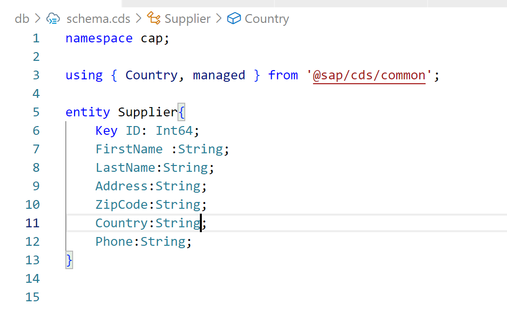
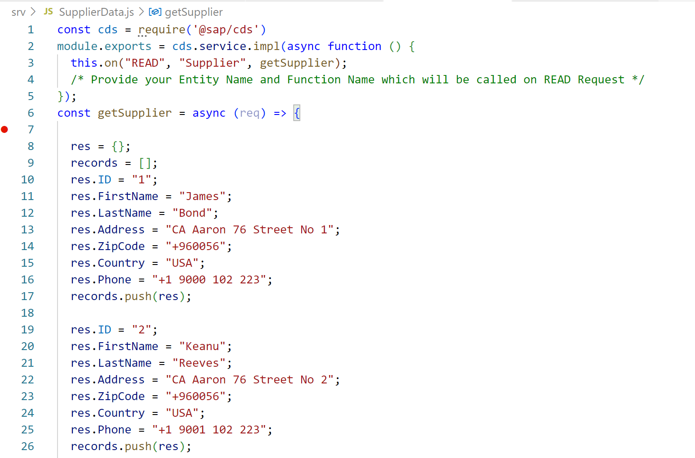

## Here we are going to Connect to SAP HANA Cloud from CAP ##

### Deploy to SAP HANA -- Fetch Data From SAP HANA Cloud ###

### Connect to HANA Cloud ###

## Pre-requisite ##
#### Get your trial account ready --- Make sure SAP HANA Cloud instance is Up and Running .....####

### Oepn Terminal and login to CF Space cf login -a User ID and Password ####

**Lets Add Hard Code Data in Supplier Entity**

* Add CDS entity Supplier 
* Add getSupplier Method for reading Supplier Data 
* Add Hard Code Array of two records Stated in Supplier.JS File 
* Return those Two records on method GET Entity Call 

**Supplier Entity**                   **Added Two Records**

         

