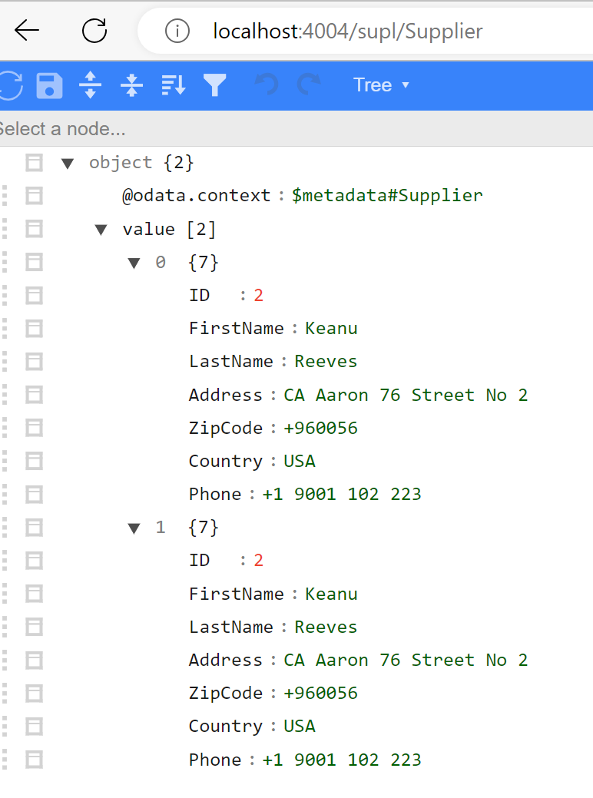
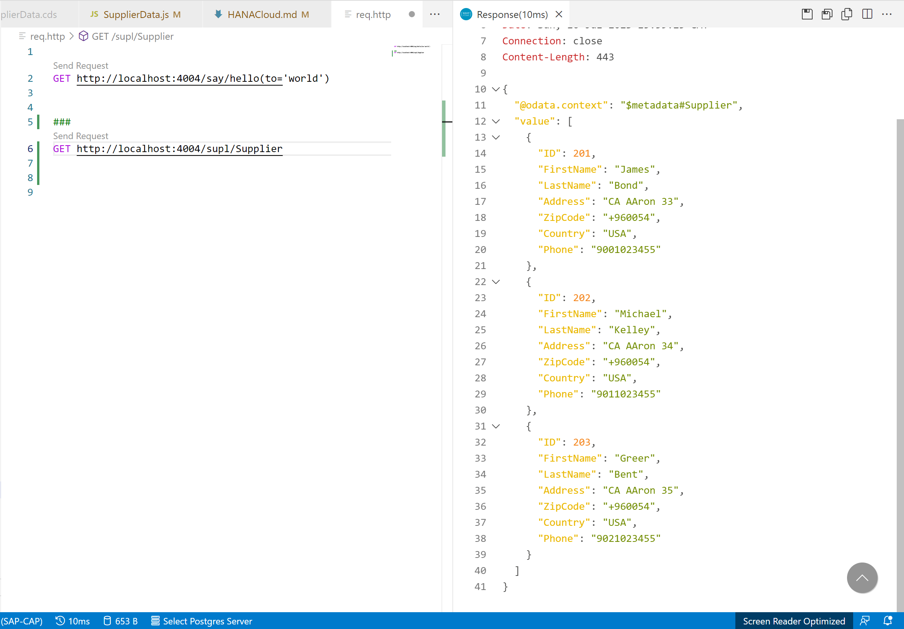
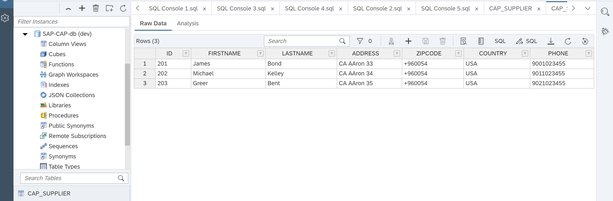
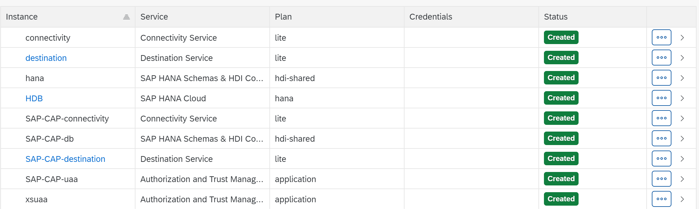
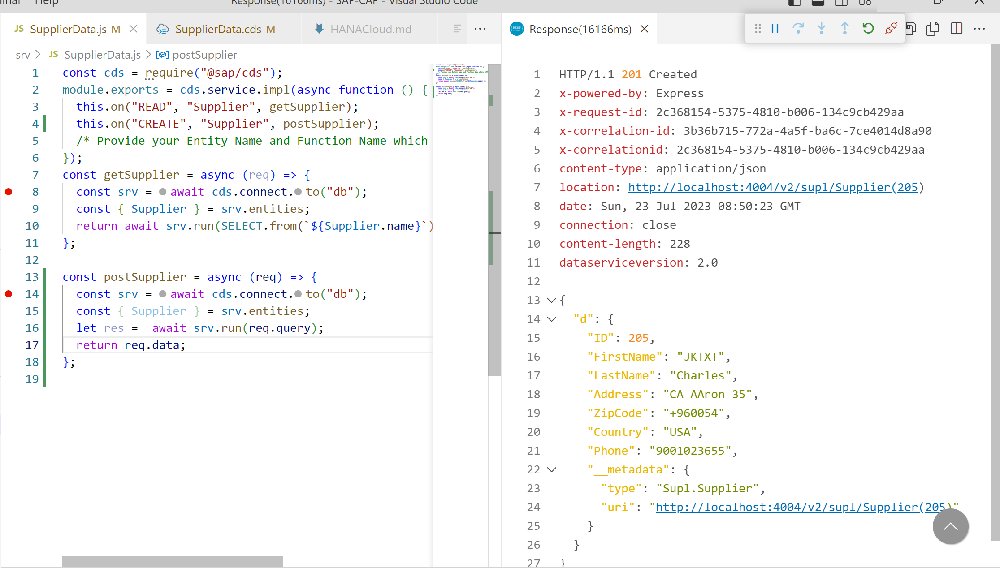
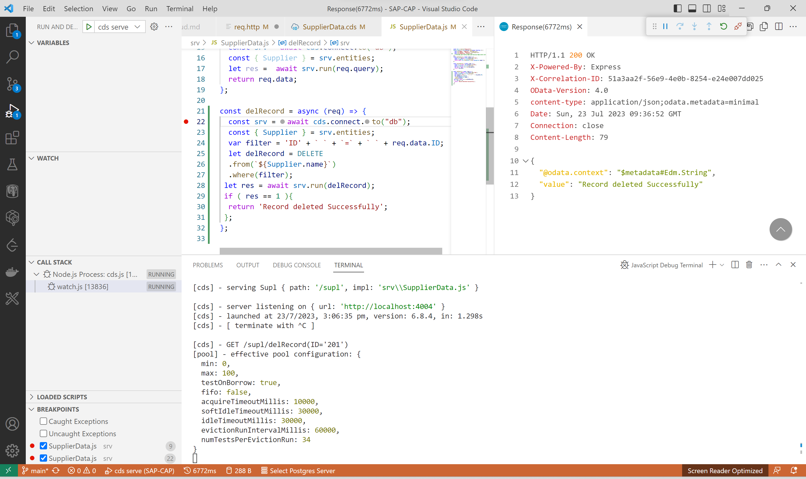
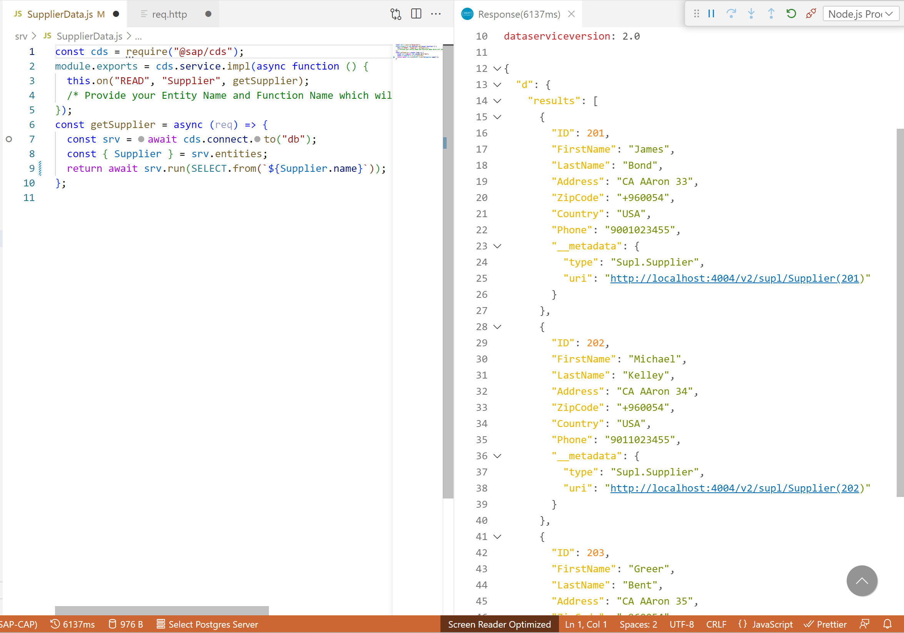

## Here we are going to Connect to SAP HANA Cloud from CAP ##

### Deploy to SAP HANA -- Fetch Data From SAP HANA Cloud ###

### Connect to HANA Cloud ###

## Pre-requisite ##
#### Get your trial account ready --- Make sure SAP HANA Cloud instance is Up and Running .....####

### Oepn Terminal and login to CF Space cf login -a User ID and Password ####

**Lets Add Hard Code Data in Supplier Entity**

* Add CDS entity Supplier 
* Add getSupplier Method for reading Supplier Data 
* Add Hard Code Array of two records Stated in Supplier.JS File 
* Return those Two records on method GET Entity Call 

**Supplier Entity**                   **Added Two Records**

         

# Run cds watch

# Output

# Upload data using CSV File 

## Execute cds add data --> It will add csv file in your data folder or add data folder it not already created.

### Steps

* Add Supplier Entity 
* Add Projection for Supplier Entity in Supplier.cds 
* Add Supplier.csv for data Upload 
* Add Dummy Data for Suppliers in CSV File with Header
* cds build 
* cds watch 

# Output

### Not Comment your code in JS File before execution otherwise it may display Old Records from Entity 

* We uploaded 3 records in CSV File

# Lets Deploy this to HANA Cloud and Upload data

## Run these Commands to prepare for HANA Cloud Deployment

### cds add mta 
### cds add hana  ( This will add db-deployer and HDI Container which will serve the purpose of Database Persistence )

## Add these Services in MTA File

### Add Connectivity Service 
### Add Destination  Service
### Add uaa          Service 

## Install Node Modules npm i 

## cds build 

## mbt build for building your CAP Project ready for deployment to Cloud Foundry 

## cf deploy mtar

* Make Sure you Have these Services and their respective service plan in place 
* HDB Instance with HDI Container ( Make sure its running) 
* Enough Memory for Services 
* Authorization and trust Management 

### Once Deployment done --> Lets run the App locally in VSCode 

## Bind Your Service instance to CAP App

* if Deployment is successful then you can see the SAP-CAP Database inside your HANA Cloud Instance with Supplier Table Created under it.

cds bind -2 destination:key
cds bind -2 connectivity:key
cds bind -2 uss:key

#### Like this

### Open Javascript debug termincal 

run cds watch --profile hyrbid 

Yeah you are ready to debug and run your Application Now

# Lets Implement CRUD Operations on this Entity and then we will move onto Associations and Join.

#### GET Call 

* Make sure to Bind your database with key 

#### POST Call 
 
* it will simply create the new entry in the database

 

#### DELETE Call ( Function Import our customer handler)

* Odata doesnt allow this dorect on entity hence we have developed on custom handler for this - i have aaded this logic in CAP --  Please go and checkout

##### CDS BIND -2 DB:KEY  So that you can execute it locally in VSCode 

GET http://localhost:4004/v2/supl/Supplier

##### Here we complete our second Exercise 

##### We will dig deeper into SQL Slowy in next Coming Turorirals Stay Tuned.

