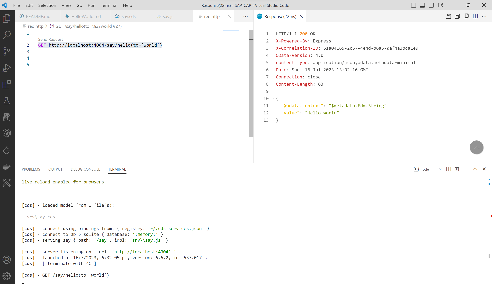

# Hello World 

## Creeat say.cds / say.js 

## Add function Hello with Importing Parameter as String and Return String with Concatenated Value 

## Run cds build 

## cds watch 

## Make A function Call GET http://localhost:4004/say/hello(to='world')

Expected Outout --- Hello Wolrd 

### Great we are done with First Programming exercise of CAP ---- I am gonna add so many exercises and Learning here in One Project.

### Goal is to make you aware how powerful the SQL is when it's meet NodeJS and SAP HANA 